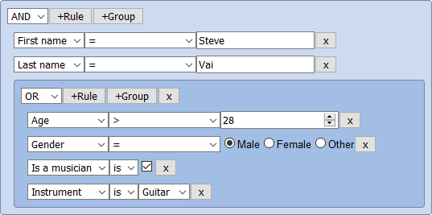

# react-querybuilder

_The Query Builder component for React_



Complete documentation is available at https://react-querybuilder.js.org.

## Getting Started

```shell
npm install react-querybuilder --save
# OR
yarn add react-querybuilder
```

## Demo

[Click here to see a live, interactive demo](https://react-querybuilder.js.org/react-querybuilder/).

<detail>
<summary>To run the demo yourself...</summary>

1. _Clone this repo_
2. `yarn` _Install dependencies_
3. `yarn start` _Run a local server_
4. _Visit http://localhost:8080 in your browser_

</detail>

To use the official compatibility components as seen in the demo (select different options in the Style dropdown), take a look at the [`@react-querybuilder` org on npmjs.com](https://www.npmjs.com/org/react-querybuilder).

## Basic usage

```tsx
import { useState } from 'react';
import QueryBuilder, { RuleGroupType } from 'react-querybuilder';

const fields = [
  { name: 'firstName', label: 'First Name' },
  { name: 'lastName', label: 'Last Name' },
  { name: 'age', label: 'Age', inputType: 'number' },
  { name: 'address', label: 'Address' },
  { name: 'phone', label: 'Phone' },
  { name: 'email', label: 'Email', validator: ({ value }) => /^[^@]+@[^@]+/.test(value) },
  { name: 'twitter', label: 'Twitter' },
  { name: 'isDev', label: 'Is a Developer?', valueEditorType: 'checkbox', defaultValue: false },
];

export const App = () => {
  const [query, setQuery] = useState<RuleGroupType>({
    combinator: 'and',
    rules: [],
  });

  return <QueryBuilder fields={fields} query={query} onQueryChange={q => setQuery(q)} />;
};
```
